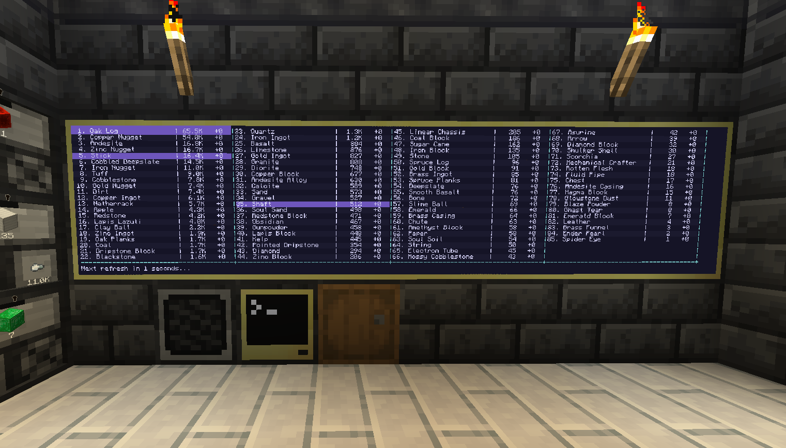
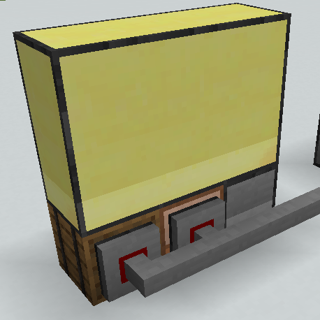
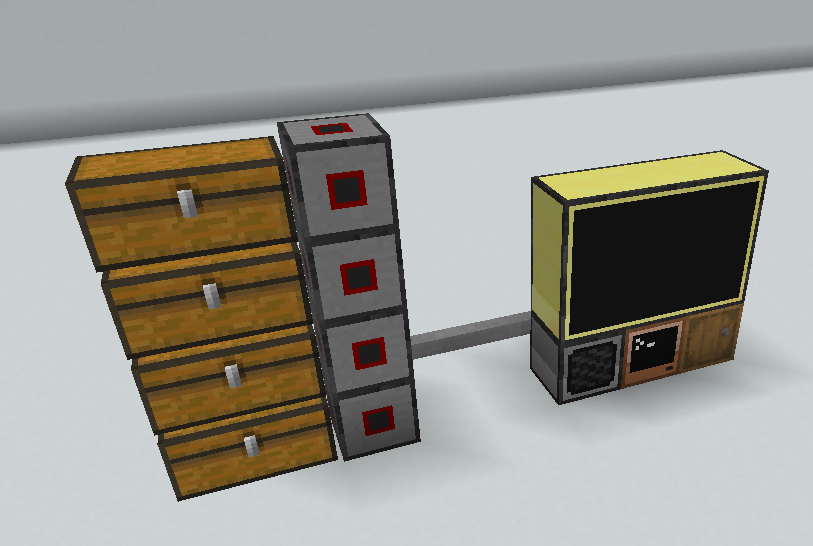

# CC:Tweaked Storage System
 A useful program for interfacing/visualizing large storage systems.
 

## Downloading
 This can be downloaded by using the following command. 
 `wget run https://raw.githubusercontent.com/HappySunChild/CC-Tweaked-Storage-System/refs/heads/main/downloader.lua`

## Requirements
1. Speaker
2. Monitors
3. Wired Modems (and cables!)
4. Any buffer inventory - Used for inputting/outputting items into the system.

## Setup
Setting up the storage system is relatively easy and cheap, as all you really need to get started is some monitors, cables, wired modems and a couple inventories to connect to the system with said wired modems.

The placement of the buffer inventory in the system does not matter, but it is recommended you have it near/next to the Computer running the system program, since it is where you make requests for inputting and outputting items from the system.

**All inventories connected to the system must be connected via Wired Modems and cables, directly placing inventories next to the Computer will not work.**

