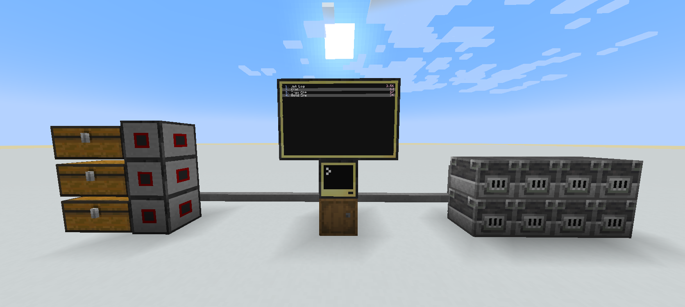
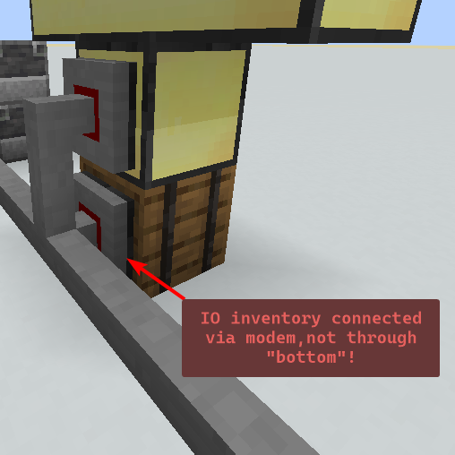

# CC:Tweaked Storage System
A useful program for interfacing with large storage systems.

**THIS PROGRAM IS DESIGNED TO WORK WITH `CC: TWEAKED 1.114.2+`!** 
It may work in older versions, but most likely not.

## Downloading
This program can be downloaded by running this command:  
`wget https://raw.githubusercontent.com/HappySunChild/CC-Tweaked-Storage-System/refs/heads/main/build/compiled.lua storagesystem.lua`

## Requirements
1. Monitors (Advanced preferably)
2. Computer (Advanced preferably)
3. IO inventory
4. Wired modems + cables
5. an internet connection

## Setup
Setting up the storage system is relatively easy and cheap, as all you need to get started is some monitors, cables, wired modems and a couple inventories to connect to the system with those wired modems.

**All inventories must be connected via Wired Modems and be on the same network!!! Including the IO inventory!!**

## Auto Processing
With the latest update this program is now capable of primitive autoprocessing! Currently there is no documentation on how to use it, so if you want to learn how to make your own patterns take a look at the example program. (A program to make editing these patterns easier is planned)

## Contributing
Contributions are always welcome! Feel free to open issues or pull requests to suggest features/code.